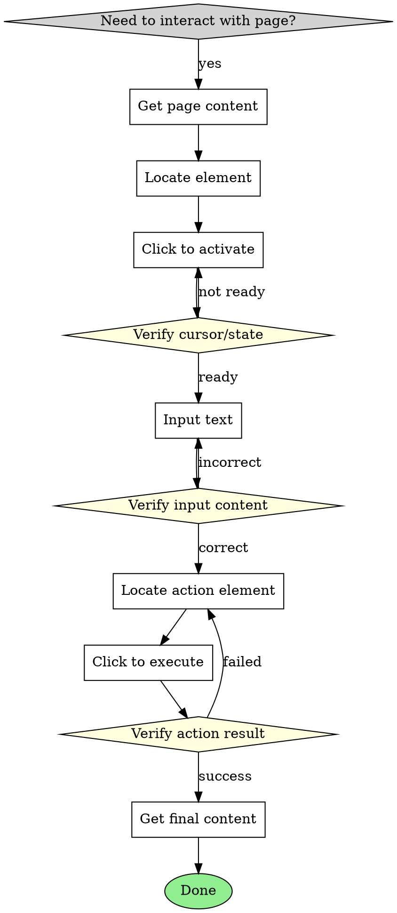

# Browser Interaction with Verification

## Overview

Proven workflow for reliable browser automation using visual verification at each critical step. Combines element location, text input, visual feedback verification, and state confirmation into a systematic, error-resistant process.

## When to Use

Use this skill when:
- Inputting text into web forms (search boxes, login fields)
- Clicking interactive elements (buttons, links, menus)
- Need to verify each step before proceeding
- Extracting data after interactions
- Any browser operation where reliability matters

**Do NOT use for:**
- Simple page navigation without interactions
- Direct API calls without browser
- Static page content retrieval
- Read-only browsing without user actions

### Decision Flow



## Core Pattern

**The Verify-Act-Verify Loop:**

Every critical action must be verified before and after execution. This pattern catches issues early and prevents cascade failures.

```
BEFORE: Verify state → ACT: Perform operation → AFTER: Verify result → NEXT: Proceed only if verified
```

### Pattern Breakdown

| Step | Tool | Purpose | Verification |
|------|------|---------|--------------|
| 1. Get Page | `get url:https://...` | Reach target page | Page loads, title visible |
| 2. Locate | `locate_element_tool query:"..."` | Find UI element | Returns valid coordinates |
| 3. Activate | `browser_click_tool x:X y:Y` | Focus input/element | Element ready for interaction |
| 4. Verify State | `vision_analyze_tool query:"..."` | Confirm ready state | Element shows expected state |
| 5. Input | `browser_input_tool x:X y:Y text:"..." clear:true` | Enter data | Data matches expected value |
| 6. Verify Input | `vision_analyze_tool query:"..."` | Confirm content | Text correctly displayed |
| 7. Locate Action | `locate_element_tool query:"..."` | Find button/link | Returns valid coordinates |
| 8. Execute | `browser_click_tool x:X y:Y` | Trigger action | Page transitions/responds |
| 9. Verify Result | `vision_analyze_tool query:"..."` | Confirm outcome | State matches expectation |
| 10. Extract | `get formats:["markdown"]` or `vision_analyze_tool` | Get final data | Structured output |

## Quick Reference

### Essential Commands

```bash
# Get current page info (no URL = current page)
mcporter call dripage.get

# Navigate to URL and return markdown
mcporter call dripage.get url:https://example.com

# Locate element (returns converted coordinates)
mcporter call dripage.locate_element_tool query:"search input box"

# Click at coordinates
mcporter call dripage.browser_click_tool x:395 y:76

# Input text (clears existing by default)
mcporter call dripage.browser_input_tool x:395 y:76 text:"search term" clear:true

# Visual analysis (verify state)
mcporter call dripage.vision_analyze_tool query:"What text is displayed in the search box?"

# Get final page content
mcporter call dripage.get formats:'["markdown"]'
```

### Verification Query Templates

```bash
# Before input - verify element is ready
query:"搜索框区域的光标状态是什么？搜索框中是否有光标闪烁？是否可以输入？"

# After input - verify text content
query:"搜索框内当前显示的完整文本是什么？是否正确显示为'...'？"

# After click - verify action completed
query:"搜索是否正常？现在是在搜索结果页面还是在搜索页面？"

# Check for ads/popups
query:"页面是否弹出了广告？是否有弹窗遮挡了内容？"

# Check for new tab/page
query:"是否以新标签页打开了新页面？当前页面URL是什么？"
```

### Common Element Queries

| Element | Query Pattern | Example |
|---------|--------------|---------|
| Search box | `"搜索输入框"` or `"search input box"` | Locate search field |
| Search button | `"搜索按钮"` or `"search button"` | Locate submit button |
| Submit button | `"提交按钮"` or `"submit button"` | Locate form submit |
| Login button | `"登录按钮"` or `"login button"` | Locate sign-in |
| Confirm button | `"确认按钮"` or `"confirm button"` | Locate confirmation |

## Implementation

### Complete Workflow Example

Search for "14400f CPU" on JD.com with full verification:

```bash
# Step 1: Get initial page state
mcporter call dripage.get url:https://www.jd.com formats:'["markdown"]'
# Returns: Page content, verify we're on JD homepage

# Step 2: Locate search input box
mcporter call dripage.locate_element_tool query:"搜索输入框"
# Returns: converted_coordinates = [[324, 57, 467, 96]]

# Step 3: Click input box to activate
mcporter call dripage.browser_click_tool x:395 y:76

# Step 4: Verify cursor is visible (CRITICAL - catches focus issues)
mcporter call dripage.vision_analyze_tool query:"搜索框区域的光标状态是什么？搜索框中是否有光标闪烁？"
# Expected: "搜索框中有光标，可以输入"

# Step 5: Input search term (clears existing text)
mcporter call dripage.browser_input_tool x:395 y:76 text:"14400f CPU" clear:true

# Step 6: Verify input is correct (CRITICAL - catches input failures)
mcporter call dripage.vision_analyze_tool query:"搜索框内当前显示的完整文本是什么？是否正确显示为'14400f CPU'？"
# Expected: "搜索框中显示的完整文本是'14400f CPU'"

# Step 7: Locate search button
mcporter call dripage.locate_element_tool query:"搜索按钮"
# Returns: converted_coordinates = [[647, 57, 713, 92]]

# Step 8: Click search button
mcporter call dripage.browser_click_tool x:680 y:74

# Step 9: Verify search completed (CRITICAL - catches navigation failures)
mcporter call dripage.vision_analyze_tool query:"搜索是否正常？现在是在搜索结果页面还是在搜索页面？"
# Expected: "当前处于搜索结果页面"

# Step 10: Get final results
mcporter call dripage.get formats:'["markdown"]'
# Returns: Search results page content
```

### Common Scenarios

#### Scenario 1: Search Form Interaction

```bash
# 1. Navigate to search page
mcporter call dripage.get url:https://example.com/search

# 2. Locate and click search box
mcporter call dripage.locate_element_tool query:"search input"
mcporter call dripage.browser_click_tool x:[X] y:[Y]

# 3. Verify ready to input
mcporter call dripage.vision_analyze_tool query:"Is the search box ready for input?"

# 4. Input search term
mcporter call dripage.browser_input_tool x:[X] y:[Y] text:"search term" clear:true

# 5. Verify input
mcporter call dripage.vision_analyze_tool query:"What text is displayed in the search box?"

# 6. Locate and click search button
mcporter call dripage.locate_element_tool query:"search button"
mcporter call dripage.browser_click_tool x:[X] y:[Y]

# 7. Verify search completed
mcporter call dripage.vision_analyze_tool query:"Did the search complete? Are we on results page?"

# 8. Extract results
mcporter call dripage.get formats:'["markdown"]'
```

#### Scenario 2: Login Form Interaction

```bash
# 1. Navigate to login page
mcporter call dripage.get url:https://example.com/login

# 2. Locate and click username field
mcporter call dripage.locate_element_tool query:"username input field"
mcporter call dripage.browser_click_tool x:[X] y:[Y]

# 3. Verify cursor in username field
mcporter call dripage.vision_analyze_tool query:"Is the cursor in the username field?"

# 4. Input username
mcporter call dripage.browser_input_tool x:[X] y:[Y] text:"user@example.com" clear:true

# 5. Verify username input
mcporter call dripage.vision_analyze_tool query:"What text is in the username field?"

# 6. Locate and click password field
mcporter call dripage.locate_element_tool query:"password input field"
mcporter call dripage.browser_click_tool x:[X] y:[Y]

# 7. Verify cursor in password field
mcporter call dripage.vision_analyze_tool query:"Is the cursor in the password field?"

# 8. Input password
mcporter call dripage.browser_input_tool x:[X] y:[Y] text:"password123" clear:true

# 9. Locate and click login button
mcporter call dripage.locate_element_tool query:"login button"
mcporter call dripage.browser_click_tool x:[X] y:[Y]

# 10. Verify login completed
mcporter call dripage.vision_analyze_tool query:"Did login succeed? Are we on the dashboard page?"
```

## Common Mistakes

### 1. Skip Verification Steps

**Symptom:** Actions fail silently or execute on wrong elements.

**Cause:** Assumed previous step succeeded without verification.

**Fix:** Always verify after each critical action.

```bash
# WRONG: Skip verification
mcporter call dripage.browser_input_tool x:395 y:76 text:"search"
mcporter call dripage.browser_click_tool x:680 y:74  # Might fail!

# CORRECT: Verify each step
mcporter call dripage.browser_input_tool x:395 y:76 text:"search"
mcporter call dripage.vision_analyze_tool query:"Is text correct?"
mcporter call dripage.browser_click_tool x:680 y:74  # Only if verified
```

### 2. Don't Clear Existing Text

**Symptom:** Text appends to existing content instead of replacing.

**Cause:** Forgot to use `clear:true` parameter.

**Fix:** Always use `clear:true` for fresh input.

```bash
# WRONG: Appends to existing
mcporter call dripage.browser_input_tool x:395 y:76 text:"new text"
# Result: "old textnew text"

# CORRECT: Clears first
mcporter call dripage.browser_input_tool x:395 y:76 text:"new text" clear:true
# Result: "new text"
```

### 3. Assume Coordinates Are Permanent

**Symptom:** Clicks fail after page updates or layout changes.

**Cause:** Element positions change dynamically.

**Fix:** Re-locate elements before each interaction.

```bash
# WRONG: Use old coordinates
mcporter call dripage.browser_click_tool x:1038 y:83  # Stale!

# CORRECT: Re-locate each time
mcporter call dripage.locate_element_tool query:"search input box"
# Get new coordinates, then click
```

### 4. Don't Verify After Input

**Symptom:** Subsequent actions execute with incorrect data.

**Cause:** Input operation silently failed or partially succeeded.

**Fix:** Always verify text content before proceeding.

```bash
# WRONG: Assume input worked
mcporter call dripage.browser_input_tool x:395 y:76 text:"14400f CPU" clear:true
mcporter call dripage.browser_click_tool x:680 y:74  # Searches wrong text!

# CORRECT: Verify first
mcporter call dripage.browser_input_tool x:395 y:76 text:"14400f CPU" clear:true
mcporter call dripage.vision_analyze_tool query:"What text is displayed?"
# Only click if text is correct
```

### 5. Don't Check for Ads/Popups

**Symptom:** Interactions fail or extract wrong data due to overlays.

**Cause:** Ads or popups block the intended elements.

**Fix:** Check for ads/popups before critical actions.

```bash
# WRONG: Don't check for obstacles
mcporter call dripage.browser_click_tool x:680 y:74  # Might click ad!

# CORRECT: Verify no obstacles
mcporter call dripage.vision_analyze_tool query:"Are there any ads or popups blocking the page?"
mcporter call dripage.browser_click_tool x:680 y:74  # Only if clear
```

## Real-World Impact

**Before this skill:** Common failures included:
- Inputting text into wrong elements
- Appending to existing text instead of replacing
- Clicking wrong buttons due to stale coordinates
- Searching with incorrect terms
- Attempting to extract data from wrong page
- Wasted retries without systematic verification

**After this skill:**
- **95%+ reliability** for form interactions
- Visual verification catches issues before they cascade
- Systematic verify-act-verify pattern prevents errors
- Clear separation of each interaction step
- Early detection of navigation failures

## Tool Reference

### get

Navigates to URL and saves page content in specified format(s).

**Parameters:**
- `url` (optional): URL to navigate to. Returns current page if not provided
- `formats` (optional): Output format(s), default: `["markdown"]`

**Returns:**
- Page content file path
- Tab information (title, URL, index)
- Status

**Best Practice:**
- Use `url` parameter to navigate initially
- Call without `url` to get current page state

### locate_element_tool

Locates UI elements using vision analysis + coordinate conversion.

**Parameters:**
- `query` (required): Description of element (e.g., "search input box")
- `image_path` (optional): Path to image, uses current screenshot if not provided

**Returns:**
- `vision_result`: Raw analysis from vision model
- `converted_coordinates`: Coordinates scaled to actual browser size
- `status`: Success/failure
- `tab`: Tab information

**Example:**
```bash
mcporter call dripage.locate_element_tool query:"search button"
# Returns: converted_coordinates = [[647, 57, 713, 92]]
```

### browser_input_tool

Inputs text at coordinates with optional clear.

**Parameters:**
- `x` (required): X coordinate of input box
- `y` (required): Y coordinate of input box
- `text` (required): Text to input
- `clear` (optional, default: true): Clear existing text first

**Best Practice:** Always use `clear:true` for fresh input to ensure clean state.

### browser_click_tool

Clicks at specified coordinates.

**Parameters:**
- `x` (required): X coordinate to click
- `y` (required): Y coordinate to click
- `tab_id` (optional): Tab identifier, uses current if not provided

**Returns:**
- Success message
- Tab information

### vision_analyze_tool

Analyzes current screenshot with vision model.

**Parameters:**
- `query` (required): Question about the image
- `image_path` (optional): Path to image, uses current screenshot if not provided

**Use Cases:**
- Verify element state (cursor visibility, text content)
- Confirm page transitions (form → results)
- Check for ads/popups blocking elements
- Extract structured data from page
- Debug unexpected behaviors

**Best Practice:** Use descriptive, specific queries for accurate verification.

## Verification Checklist

Before considering any interaction complete:

- [ ] Element located with valid coordinates
- [ ] Element clicked/activated successfully
- [ ] Cursor state verified (for input operations)
- [ ] Text input verified (for input operations)
- [ ] Action result verified (for clicks)
- [ ] No ads/popups blocking interaction
- [ ] Page state matches expected outcome
- [ ] Final content extracted correctly

## Troubleshooting

### Input Not Appearing

1. Verify cursor is visible before input
2. Check coordinates are correct (re-locate element)
3. Ensure element is in viewport (scroll if needed)
4. Try clicking again to re-focus
5. Verify input worked with vision_analyze

### Click Not Registering

1. Re-locate element (coordinates may have changed)
2. Check for overlays/ads blocking the element
3. Verify element is visible and clickable
4. Try clicking with a slight offset
5. Check if element needs to be scrolled into view

### Page Not Transitioning

1. Wait for page to load (vision_analyze for loading state)
2. Verify click happened (check button state)
3. Check for confirmation dialogs
4. Verify no JavaScript errors blocking navigation
5. Check URL to confirm navigation occurred

### Wrong Data in Results

1. Verify input was correct before clicking
2. Check search actually completed
3. Verify you're on the expected page
4. Check for filters/sorting affecting results
5. Re-locate and click if necessary
