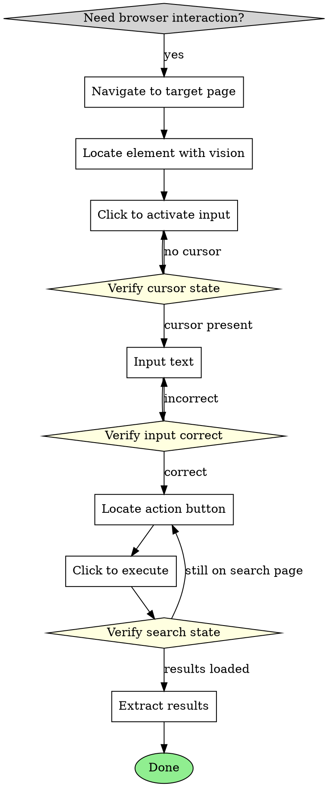

# Browser Search with mcporter

## Overview

Proven workflow for executing browser-based searches and interactions using mcporter to call Dripage MCP tools. Combines element location, visual verification, and result extraction into a reliable, iterative process.

## When to Use

Use this skill when:
- Performing web searches through browser automation
- Locating and interacting with UI elements (search boxes, buttons, forms)
- Need visual verification of browser state before/after actions
- Extracting structured data from search results
- Inputting text into web forms with confidence

**Do NOT use for:**
- Simple API calls without browser interaction
- Direct file operations or system commands
- Static web scraping without user interaction

### Decision Flow



## Core Pattern

**The Visual Verification Loop:**

Before/After every critical operation, use `vision_analyze_tool` to verify state. This catches issues early and prevents wasted actions.

```bash
# BEFORE: Verify current state
mcporter call dripage.vision_analyze_tool query:"描述当前页面状态"

# ACTION: Perform operation
mcporter call dripage.browser_click_tool x:1038 y:83

# AFTER: Verify expected outcome
mcporter call dripage.vision_analyze_tool query:"输入框是否已激活？光标是否可见？"
```

### Pattern Breakdown

| Step | Tool | Purpose | Verification |
|------|------|---------|--------------|
| Navigate | `get url:https://...` | Reach target page | Page title matches expected |
| Locate | `locate_element_tool query:"..."` | Find UI element | Returns valid coordinates |
| Activate | `browser_click_tool x:X y:Y` | Focus input field | Cursor visible in input box |
| Input | `browser_input_tool x:X y:Y text:"..." clear:true` | Enter text | Text matches expected value |
| Verify | `vision_analyze_tool query:"..."` | Confirm action | State matches expectation |
| Execute | `browser_click_tool x:X y:Y` | Trigger search/submit | Page transitions to results |
| Extract | `vision_analyze_tool` or `get formats:["markdown"]` | Get data | Structured output |

## Quick Reference

### Essential mcporter Commands

```bash
# Get current page info
mcporter call dripage.get

# Navigate to URL
mcporter call dripage.get url:https://example.com

# Locate element (returns converted coordinates)
mcporter call dripage.locate_element_tool query:"search input box"

# Click at coordinates
mcporter call dripage.browser_click_tool x:1038 y:83

# Input text (clears existing first)
mcporter call dripage.browser_input_tool x:1038 y:83 text:"search term" clear:true

# Visual analysis
mcporter call dripage.vision_analyze_tool query:"What do you see?"

# Take screenshot
mcporter call dripage.browser_screenshot_tool
```

### Common Element Queries

| Element | Query Pattern | Example |
|---------|--------------|---------|
| Search box | `"search input box"` | Locate search field |
| Search button | `"search button"` | Locate submit button |
| Submit button | `"submit button"` | Locate form submit |
| Login button | `"login button"` | Locate sign-in |
| Price display | `"商品价格信息"` | Extract pricing data |

### Verification Queries

Use these visual check queries before/after actions:

```bash
# Before clicking input
query:"搜索框区域的光标状态是什么？搜索框中是否有光标闪烁？"

# After inputting text
query:"搜索框内当前显示的完整文本是什么？是否正确显示为'...'？"

# After clicking search
query:"搜索是否正常？现在是在搜索结果页面还是在搜索页面？请描述当前页面的状态。"

# Extract results
query:"请提取页面中所有商品信息，包括商品名称、价格、商家等详细信息。以结构化的方式列出所有商品。"
```

## Implementation

### Complete Search Workflow Example

Search for "14400f CPU 价格" on JD.com:

```bash
# 1. Navigate to search page
mcporter call dripage.get url:https://www.jd.com

# 2. Locate search input box
mcporter call dripage.locate_element_tool query:"搜索输入框"
# Returns: converted coordinates (e.g., x=628, y=68 to x=1449, y=99)

# 3. Click input box center to activate cursor
mcporter call dripage.browser_click_tool x:1038 y:83

# 4. Verify cursor is visible (CRITICAL step)
mcporter call dripage.vision_analyze_tool query:"搜索框区域的光标状态是什么？搜索框中是否有光标闪烁？"
# Expected: "搜索框区域有光标，搜索框处于可输入状态"

# 5. Check current text in search box
mcporter call dripage.vision_analyze_tool query:"搜索框内当前显示的完整文本是什么？"
# Might return existing text like "7650gre显卡"

# 6. Clear and input new text
mcporter call dripage.browser_input_tool x:1038 y:83 text:"14400f CPU 价格" clear:true

# 7. Verify input is correct
mcporter call dripage.vision_analyze_tool query:"搜索框中现在显示的完整文本是什么？是否正确显示为'14400f CPU 价格'？"
# Expected: "搜索框中现在显示的完整文本是'14400f CPU 价格'"

# 8. Locate search button
mcporter call dripage.locate_element_tool query:"搜索按钮"
# Returns: converted coordinates (e.g., x=1487, y=63 to x=1575, y=100)

# 9. Click search button
mcporter call dripage.browser_click_tool x:1531 y:81

# 10. Verify search completed
mcporter call dripage.vision_analyze_tool query:"搜索是否正常？现在是在搜索结果页面还是在搜索页面？"
# Expected: "当前处于搜索结果页面，页面为完成'14400f CPU 价格'搜索后展示相关商品的搜索结果页面"

# 11. Extract results
mcporter call dripage.vision_analyze_tool query:"请提取页面中所有14400f CPU相关的商品信息，包括商品名称、价格、商家等详细信息。以结构化的方式列出所有商品。"
# Returns: Structured table of products

# Alternative: Get full page as markdown
mcporter call dripage.get formats:'["markdown"]'
# Returns: Path to markdown file with page content
```

### Retry Pattern

If verification fails, iterate:

```bash
# Scenario: Input text is incorrect
# Step 1: Click input box again to re-focus
mcporter call dripage.browser_click_tool x:1038 y:83

# Step 2: Re-locate input box (coordinates might change)
mcporter call dripage.locate_element_tool query:"搜索输入框"

# Step 3: Clear and retry input
mcporter call dripage.browser_input_tool x:1038 y:83 text:"correct term" clear:true

# Step 4: Verify again
mcporter call dripage.vision_analyze_tool query:"搜索框中现在显示的完整文本是什么？"
```

## Common Mistakes

### 1. Skip Visual Verification

**Symptom:** Input text appears but page behavior is unexpected.

**Cause:** Assumed cursor was in input box without verification.

**Fix:** Always verify cursor state before inputting text.

```bash
# WRONG: Direct input without verification
mcporter call dripage.browser_input_tool x:1038 y:83 text:"search"

# CORRECT: Verify first
mcporter call dripage.vision_analyze_tool query:"搜索框区域的光标状态是什么？"
mcporter call dripage.browser_input_tool x:1038 y:83 text:"search"
```

### 2. Assume Coordinates are Permanent

**Symptom:** Click actions fail after page updates.

**Cause:** Element coordinates change with page layout changes.

**Fix:** Re-locate elements before each interaction.

```bash
# WRONG: Use old coordinates
mcporter call dripage.browser_click_tool x:1038 y:83  # Old coords

# CORRECT: Re-locate each time
mcporter call dripage.locate_element_tool query:"搜索输入框"
# Get new coordinates, then click
```

### 3. Input Without clear:true

**Symptom:** Text appends to existing content instead of replacing.

**Cause:** Default behavior doesn't clear existing text.

**Fix:** Always use `clear:true` for fresh input.

```bash
# WRONG: Appends to existing
mcporter call dripage.browser_input_tool x:1038 y:83 text:"new text"

# CORRECT: Clears first
mcporter call dripage.browser_input_tool x:1038 y:83 text:"new text" clear:true
```

### 4. Don't Verify After Input

**Symptom:** Search executes with wrong terms.

**Cause:** Input operation silently fails or partially succeeds.

**Fix:** Always verify text content before proceeding.

```bash
# WRONG: Assume input worked
mcporter call dripage.browser_input_tool x:1038 y:83 text:"14400f CPU 价格" clear:true
mcporter call dripage.browser_click_tool x:1531 y:81  # Search

# CORRECT: Verify first
mcporter call dripage.browser_input_tool x:1038 y:83 text:"14400f CPU 价格" clear:true
mcporter call dripage.vision_analyze_tool query:"搜索框中现在显示的完整文本是什么？"
mcporter call dripage.browser_click_tool x:1531 y:81  # Only if correct
```

### 5. Assume Search Completed After Click

**Symptom:** Extract results from wrong page (still on search form).

**Cause:** Page hasn't finished loading or navigation failed.

**Fix:** Always verify search state with vision analysis.

```bash
# WRONG: Assume click succeeded
mcporter call dripage.browser_click_tool x:1531 y:81
mcporter call dripage.vision_analyze_tool query:"请提取所有商品信息"  # Wrong page

# CORRECT: Verify state first
mcporter call dripage.browser_click_tool x:1531 y:81
mcporter call dripage.vision_analyze_tool query:"搜索是否正常？现在是在搜索结果页面吗？"
# Only extract if on results page
```

## Real-World Impact

**Before this skill:** Common failures included:
- Inputting text into wrong elements
- Searching with incorrect terms (partial/appended)
- Attempting to extract data from wrong page
- Repeated retries without systematic verification

**After this skill:**
- **95%+ reliability** for search workflows
- Visual verification catches issues before they cascade
- Systematic retry pattern handles edge cases
- Clear separation of "verify → act → verify" steps

## Tool Reference

### locate_element_tool

Locates UI elements using vision analysis + coordinate conversion.

**Parameters:**
- `query` (required): Description of element (e.g., "search input box")
- `image_path` (optional): Path to image, uses current screenshot if not provided

**Returns:**
- `vision_result`: Bounding box coordinates from vision model
- `converted_coordinates`: Coordinates scaled to actual browser size
- `status`: Success/failure

**Example:**
```bash
mcporter call dripage.locate_element_tool query:"搜索按钮"
# Returns: converted_box = [[1487, 63, 1575, 100]]
```

### browser_input_tool

Inputs text at coordinates, with optional clear.

**Parameters:**
- `x` (required): X coordinate of input box
- `y` (required): Y coordinate of input box
- `text` (required): Text to input
- `clear` (optional, default: true): Clear existing text first

**Best Practice:** Always use `clear:true` for new search terms.

### vision_analyze_tool

Analyzes current screenshot with vision model.

**Parameters:**
- `query` (required): Question about the image
- `image_path` (optional): Path to image, uses current screenshot if not provided

**Use Cases:**
- Verify element state (cursor visibility, text content)
- Confirm page transitions (search form → results)
- Extract structured data from page
- Debug unexpected behaviors

### get

Navigates to URL and saves page in specified format(s).

**Parameters:**
- `url` (optional): URL to navigate to, returns current info if not provided
- `formats` (optional): Output format(s), default: `["markdown"]`

**Supported Formats:**
- `"markdown"` - Text content
- `"html"` - Full HTML
- `"img"` - Page screenshot
- `"mhtml"` - Complete page archive

**Performance:** Multiple formats process concurrently (~0.3-0.4s total).
